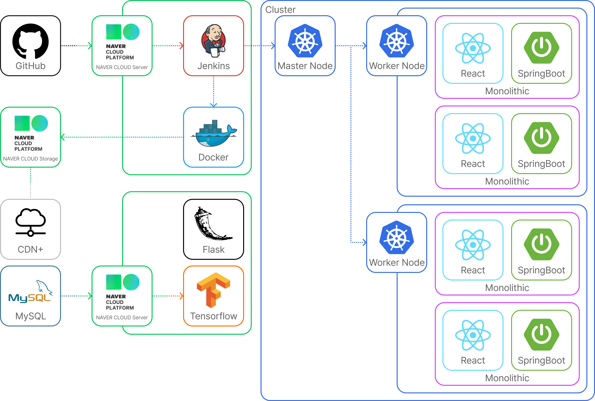

# BitKurly

## 기획 의도

### 개요

이 프로젝트는 대규모 트래픽을 견딜 수 있도록 설계된 엔터프라이즈급 쇼핑몰 사이트입니다. 쇼핑몰 사이트는 현대의 디지털 상거래 환경에서 필수적인 요소로, 사용자의 편의성과 안정성을 극대화하여 최고의 사용자 경험을 제공하는 것을 목표로 합니다.

### 목표

1. **고성능 및 확장성**
    - **고성능 서버**: 최신 서버 기술을 사용하여 대규모 트래픽을 처리할 수 있는 환경을 구축합니다.
    - **클라우드 인프라**: Naver Cloud Platform 클라우드 서비스를 활용하여 자동 확장 및 부하 분산을 구현합니다.

3. **유연한 아키텍처**
    - **API 중심 설계**: RESTful API를 사용하여 프론트엔드와 백엔드 간의 유연한 통신을 구현합니다.
    - **모듈화**: 코드의 재사용성과 유지보수성을 높이기 위해 모듈화된 구조를 채택합니다.

4. **사용자 경험**
    - **추천 시스템**: 사용자의 조회 기록을 바탕으로 딥러닝을 진행하여 고객 맞춤형 추천 시스템을 구축합니다.
    - **반응형 디자인**: 다양한 디바이스에서 최적의 사용자 경험을 제공하기 위해 반응형 디자인을 구현합니다.
    - **편리한 UI/UX**: 사용자의 직관적인 네비게이션과 원활한 상호작용을 위해 최신 UI/UX 트렌드를 반영합니다.

5. **운영 및 모니터링**
    - **지속적인 통합 및 배포 (CI/CD)**: Jenkins, GitHub Webhooks 등을 사용하여 자동화된 배포 파이프라인을 구축합니다.
    - **모니터링 및 로깅**: Effective Log Search & Analytics 을 사용하여 실시간 시스템 모니터링 및 로그 관리를 구현합니다.
    - **장애 대응**: Cloud Storage 버전 관리, Rollout 등 고가용성 아키텍처를 통해 장애 발생 시 빠르게 대응할 수 있는 시스템을 설계합니다.

### 결론

이 프로젝트는 단순한 온라인 쇼핑몰을 넘어서, 대규모 트래픽과 다양한 사용자 요구를 처리할 수 있는 고성능, 고확장성, 고안정성의 엔터프라이즈급 쇼핑 플랫폼을 제공하는 것을 목표로 합니다. 이를 통해 사용자에게는 최상의 쇼핑 경험을, 운영자에게는 안정적이고 효율적인 관리 환경을 제공하고자 했습니다.

## 기능

- 사용자 인증 및 권한 관리 (로그인, 회원가입, 비밀번호 재설정)
- 제품 목록, 검색 및 필터링
- 고객 맞춤형 추천 시스템
- 장바구니 및 주문 처리
- 고객 Q&A 게시판
- 관리자 대시보드 (제품, 주문, 사용자 관리)
- 반응형 디자인

## 기술 스택

**프론트엔드**
<p align="left">
  
  
  
  
  
  
</p>

**백엔드**
<p align="left">
  
  
  
</p>

**데이터베이스**
<p align="left">
  
</p>

**인프라**
<p align="left">
  
  
  
  
  
  
</p>

## 기술 설계
<p align="left">
  
</p>

## 설치 및 실행

로컬 환경에서 이 프로젝트를 실행하려면 다음 단계를 따르세요.

### 사전 요구 사항

- openjdk 17
- npm 또는 yarn

### 설치
   ```bash
  git clone https://github.com/Mendax17/BitMart.git
  cd ~/BitMart
  chmod +x gradlew
  ./gradlew build
  cd ~/BitMart/build/libs
  java -jar BitMart-0.0.1-SNAPSHOT.jar
   ```


### 프로젝트 팀원

<table>
  <tr>
    <td align="center">
      <br />
      <sub><b>팀장: 박건률</b></sub>
    </td>
    <td align="center">
      <br />
      <sub><b>팀원: 김동빈</b></sub>
    </td>
    <td align="center">
      <br />
      <sub><b>팀원: 최현주</b></sub>
    </td>
    <td align="center">
      <br />
      <sub><b>팀원: 김지혜</b></sub>
    </td>
    <td align="center">
      <br />
      <sub><b>팀원: 최도담</b></sub>
    </td>
    <td align="center">
      <br />
      <sub><b>팀원: 이소훈</b></sub>
    </td>
    <td align="center">
      <br />
      <sub><b>팀원: 신수경</b></sub>
    </td>
  </tr>
</table>

## 📜 시연 영상
신연 영상 입니다.<br>
[](https://youtu.be/KuC75BzBEE8)


